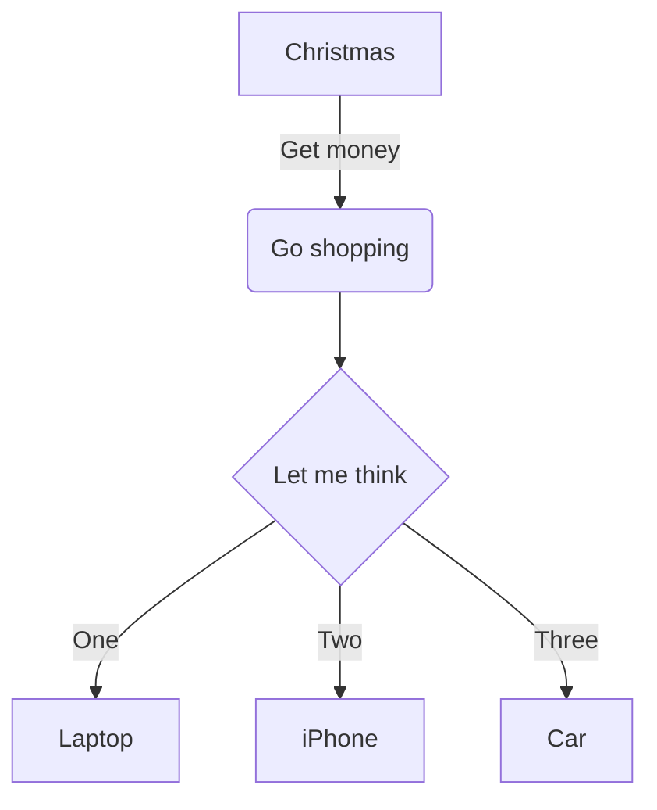

## mermaidのテスト
これは普通の文章


```javascript
const hoge = 'this is mermaid test'
```


```mermaid
graph TD
    A[Christmas] -->|Get money| B(Go shopping)
    B --> C{Let me think}
    C -->|One| D[Laptop]
    C -->|Two| E[iPhone]
    C -->|Three| F[Car]
```